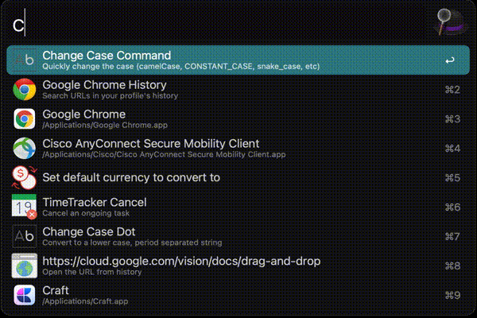
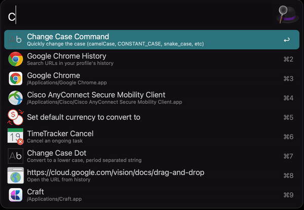

# Change case alfred workflows

## Installation

## Usage

|Command|Explanation|
|--|--|
|cc commands| list camel, constant, dot, lower, lcfirst, no, param, pascal, path, sentence, snake, swap, title, upper, ucfirst All|
|cc camel| Convert to a string with the separators denoted by having the next letter capitalised|
|cc constant| Convert to an upper case, underscore separated string|
|cc dot| Convert to a lower case, period separated string|
|cc lower| Convert to a string in lower case|
|cc lcfirst| Convert to a string with the first character lower cased|
|cc no| Convert the string without any casing (lower case, space separated)|
|cc param| Convert to a lower case, dash separated string|
|cc pascal| Convert to a string denoted in the same fashion as camelCase, but with the first letter also capitalised|
|cc path| Convert to a lower case, slash separated string|
|cc sentence| Convert to a lower case, space separated string|
|cc snake| Convert to a lower case, underscore separated string|
|cc swap| Convert to a string with every character case reversed|
|cc title| Convert to a space separated string with the first character of every word upper cased|
|cc upper| Convert to a string in upper case|
|cc ucfirst| Convert to a string with the first character upper cased|